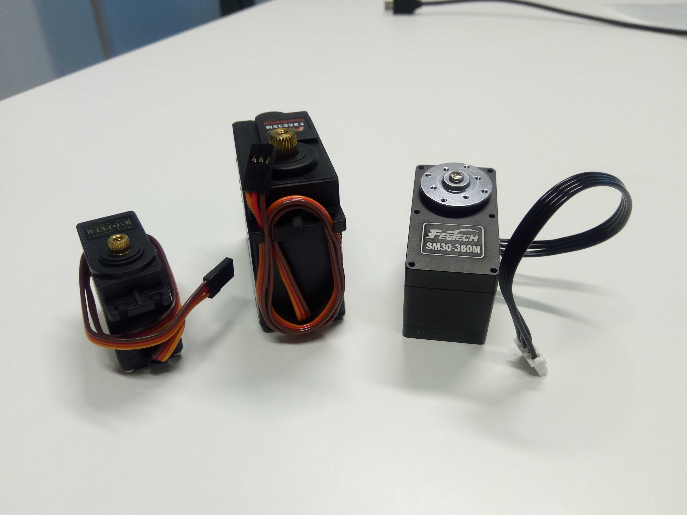
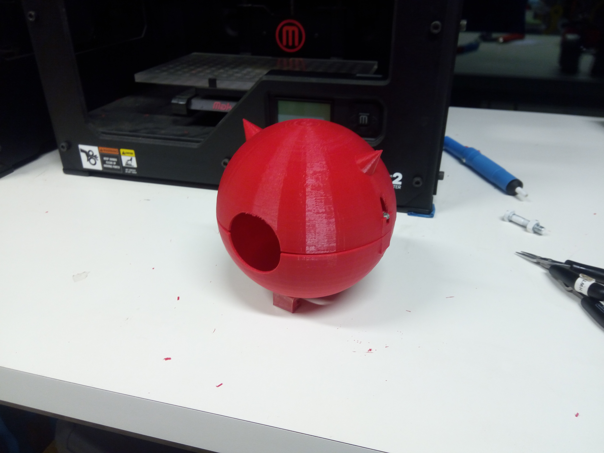

## Hardware

`Last Modfified: 2018-06-03`

A quick message from our team since the last blog update - progress is good!
Much has happened since our last blog, we'll only cover a few of the highlights
here.

Much of the hardware has arrived, including various motors, parts for power
supplies and much more. We're still waiting on some straggling parts but we
expect those to arrive soon. See some of the images of the selected parts
below:

3D printing is also well under way, with us slowly going from design to
real-life models. It's nice to see a design go from this:

To this:

To this:

In our next updates, we plan to provide details on:

* 3D modelling of motors
* 3D modelling of chassis
* 3D printing of these various parts
* Our initial approach to vision
* Interfacing with the hardware motors

Stay tuned for our next update.
