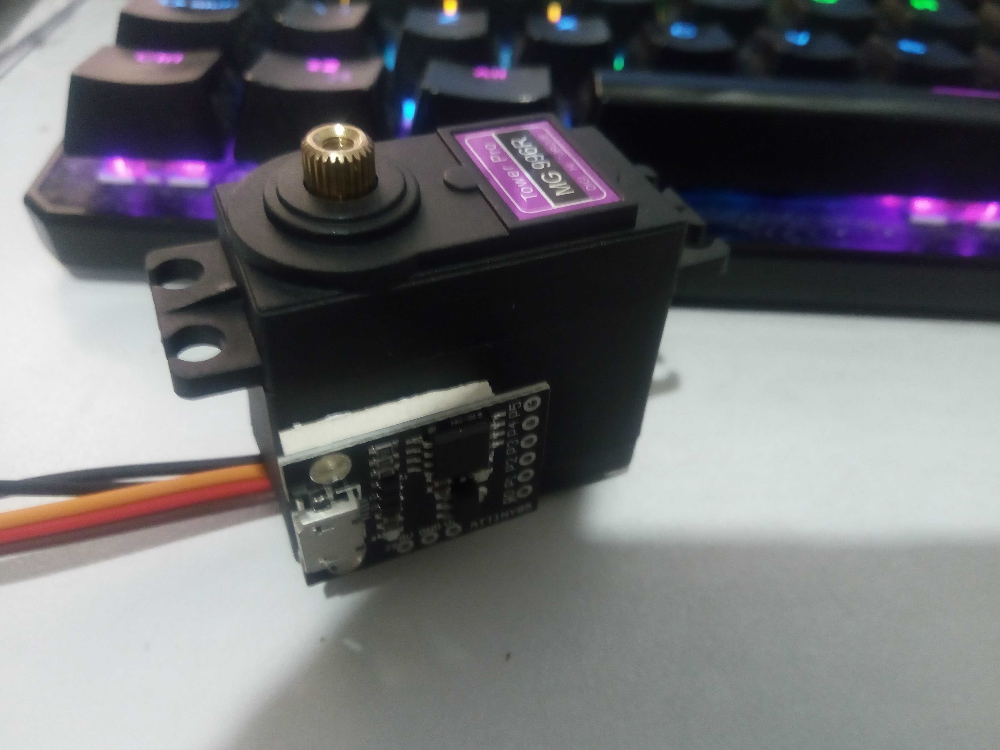

## Project - PWM Motor

`Last Modfified: 2021-04-04`

The team embark on a new project towards creating open source motors, looking
to initially modify the very popular MG996R PWM motor to have a custom
controller board. The intention is to run this low power 11kg/cm motor at a
higher voltage and to implement a serial-based motor control protocol.

*Why use an existing motor?* A while back we experimented building our own
gears, but the tolerances required are quite high - something we would need to
manufacture. In turn, all of the cost savings are lost. We therefore decided to
bypass this problem by implementing our own motor controller into an existing
motor platform.

If our experiments are successful, even a low power motor controller via serial
could be useful for the head. We can then apply the same methodology to larger
motors. The intention will be to open source our drop-in replacement controller
and the source code, so that the entire community can benefit.

As seen in the pictures, we have begun hacking on the MG996R. The intention is
to run the motor with the existing gears, DC motor and driver transistors - but
controller via the very capable ATtiny85. This has just enough pins to support
the serial communications, motor positioning and a temperature sensor.

To allow for easier programming, we will use the Digispark controller, which
allows for programming via the Arduino IDE. This little controller will happily
churp at 16MHz, which should offer enough speed to do PID and perhaps other
cool algorithms.

We will keep you updated on this project, so please check back regularly or
subscribe to the RSS feed. Thanks for reading!
