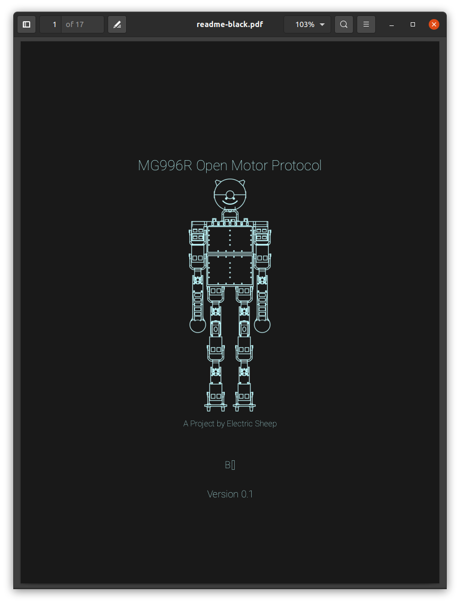

## Project - PWM Motor (Part 2)

`Last Modfified: 2021-04-12`

Following up from the motor project described
[last week](/blg/2021-04-04.html), we have begun the process of programming the
initial prototype device. As previously mentioned, the controller is to be
based on the very low-cost 8-bit ATtiny85 controller.

In the previous blog we showed pictures of the Digispark controller wired up,
which then got blown up, but has since been resurrected. We intend to continue
working on the hardware now that the software has been proven out more
reliably.

As you may or may not be aware, the controller, whilst being cheap and offering
nice interfaces, is extremely resource constrained. We have just 6kB of storage
to work with, which must contain the USB serial interface and motor protocol
encoding/decoding, as well as all other features - of which we currently use
approximately 4kB. We also have just 512 bytes of RAM, which we currently use
355 bytes of.

In the above image you can see the initial implementation of our motor control
protocol, as well as the initial (dumb) debug tools to ensure the raw packets
are as expected. You can see the build process is also built on top of
`arduino-cli`, meaning that the firmware is really easy to write and for others
to experiment with.

Part of the process has been in documenting the motor modification, including
the reverse engineering process, build environment, design, initial prototype
and the protocol.

Stay tuned! Subscribe to the RSS feed for future updates and check back
regularly!
