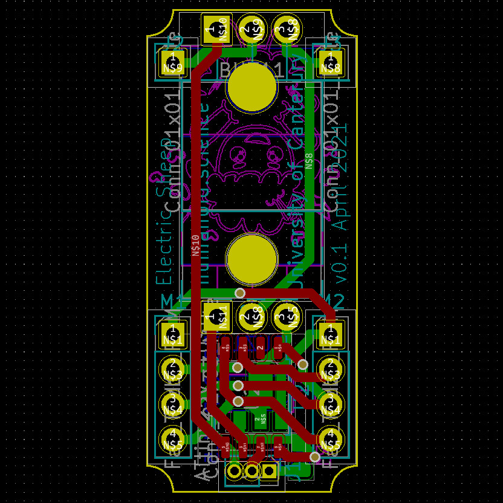
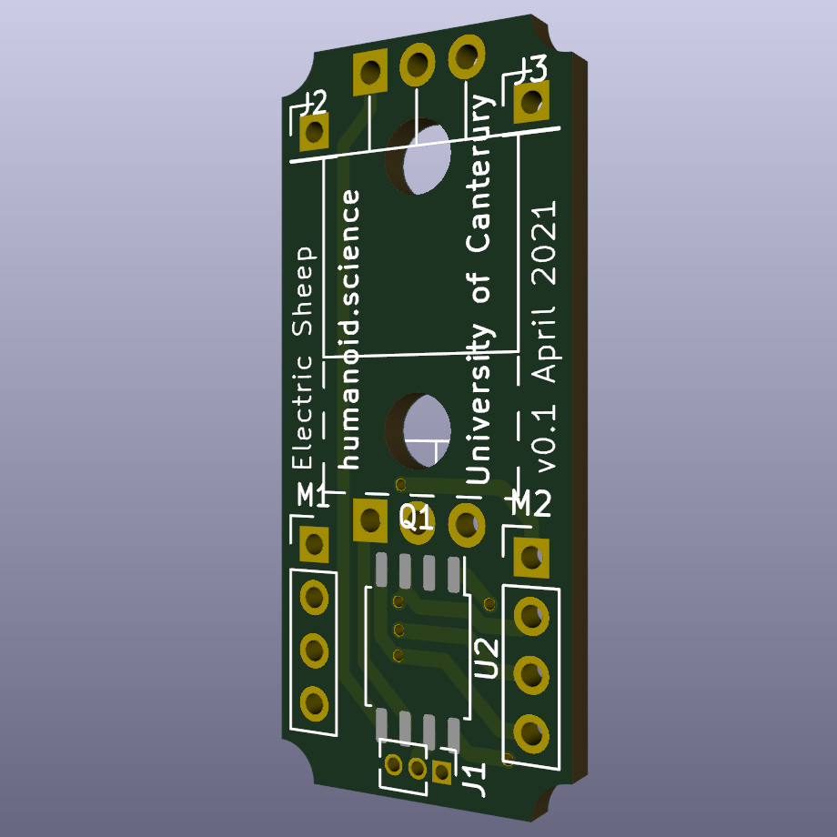
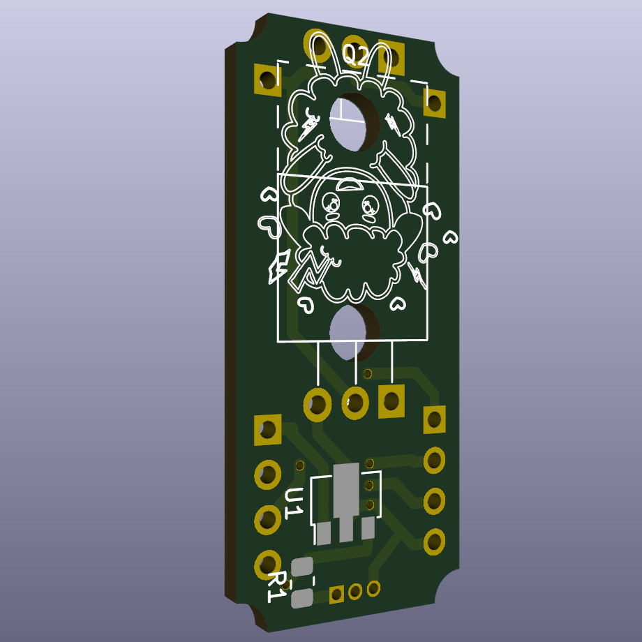
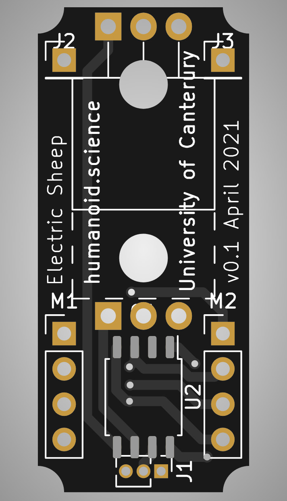

## Project - PWM Motor (Part 4)

`Last Modfified: 2021-04-26`

Another week, another update! Following up from the [previous
update](/blg/2021-04-18.html), we have some more progress.

Below is the final images for the v0.1 PCB design. The outside PCB trace is now
set correctly, meaning the 3D rendering process displays the board correctly.
As a result of this, the auto-routing software had a proper boundary to work
with and was therefore able to find better solutions to the routing problem.

The board itself has been through several automated validation processes and
*in theory* should work in the most basic sense of the word.

After finally getting this right, we sent the first version of the boards off
to be manufactured! We already know that there will be some problems with this
board:

* No programming method (we need to be able to load code onto the board).
* MOSFETs may not be suitable for multi-direction DC motor control (we believe
we have a workaround for this for the time being).
* The controller may not have the voltage or current to drive the MOSFET gates.

On the plus side, there are a few benefits to getting the board manufactured at
this stage:

* Validate auto-routing process
* Validate basic circuit properties
* Make sure the dimensions are correct for the motor housing
* Figure out if the support circuitry is sufficient to support the controller
* Ensure PCB holes are of the correct size for wire gauge and chosen connectors
* Test the upper current limit of PCB traces (specifically power traces)
* Test chaining multiple motors together to ensure the signal doesn't degrade
(distance and number of motors may be a problem)
* Mini-PCB business cards!
* Funding justification ("look, we're making cool stuff!")

There are probably many other pieces of validation that can be achieved before
sending the next batch off.

The boards were sent off soon after the last update and we expect these to
arrive soon after this update. We can then begin the task of validating that
every part is correctly electrically connected and disconnected as appropriate.

Check back regularly for further updates!
