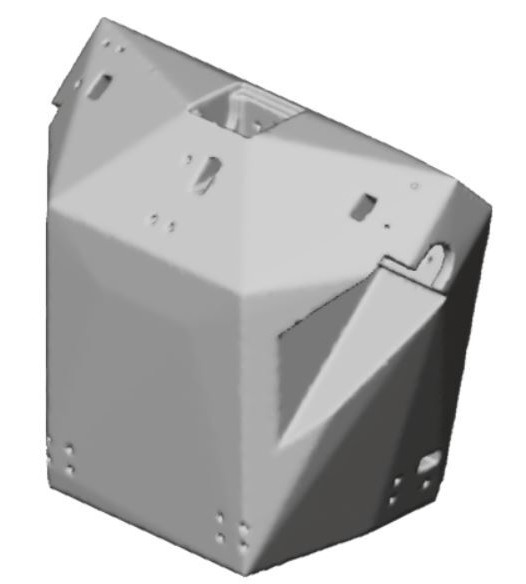
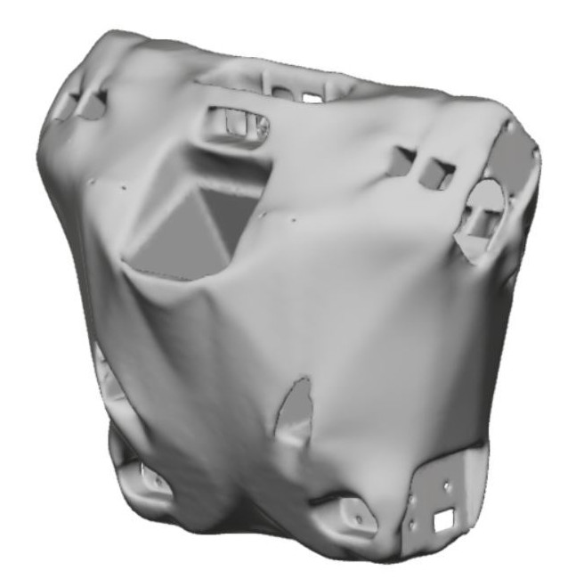
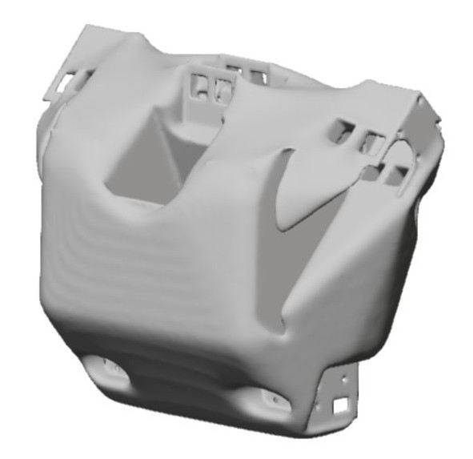

## Torso Design

`Last Modfified: 2021-04-28`

Due to the ongoing COVID situation things have been a little different last
year and this year, with teams having to adapt and work remotely. One of the
many benefits of living in New Zealand has been the successful quarantine
measures, meaning the team has been able to continue to meet on a regular
basis.

This year the competition will be virtual, and as such, has allowed us a unique
opportunity to improve the humanoid and go after harder to reach goals. One of
these investments has been a computation-based redesign of the humanoid
structure.

The original torso was coded by hand in OpenSCAD, a language to define 3D
shapes. This got us to the competition in Sydney, Australia 2019, but was far
from perfect. It was heavy, weak, hard to work on (you had to break the torso
apart to rewire it), didn't allow for great manoeuvrability - and a long list
of other problems.

Great work was done to port the models into a 3D CAD software and they were
incrementally improved, smoothed, strengthened and redesigned. These parts were
far superior to the original parts, but required many more hours of work to
make even small adjustments.

This got us thinking: *What if we could get a computer to do all the work?*

The idea is that we define a set of rules for the 3D model and let the computer
design the torso for us. This method is called [*generative
design*](https://en.wikipedia.org/wiki/Generative_Design) and various CAD
solutions have been around for years, with it only recently becoming accessible
for free on a student license.

As you can see, some of the design outputs are much harder-edged and others
look much more organic.

Some of these designs are getting increasingly more human-like!

Clearly more work is needed in order to better define restrictions to the
models, it's not usually used for objects with such complexity. We do believe
however that the initial results are very promising and there could well be a
viable path forwards with this approach.

Subscribe to the RSS feed for further updates!
