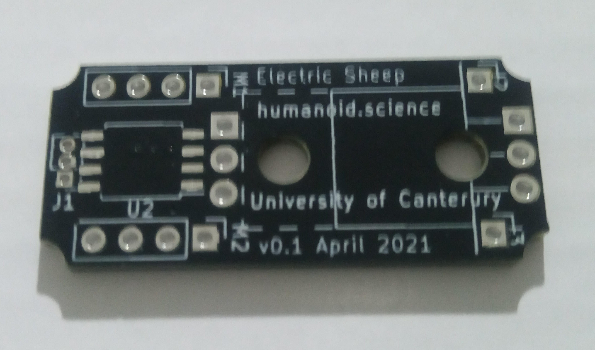

## Project - PWM Motor (Part 5)

`Last Modfified: 2021-05-01`

This update is a continuation of the PWM [motor project](/blg/2021-04-26.html).
The goal of the project is to create a new controller board for standard PWM
motors that add advanced capabilities and increased motor torque.

Some PCBs finally arrived! Here are some images (apologies for the potato
camera pictures):

The boards look really nice and came out exactly as planned. They even fit the
motor housing nicely with the rounded corners avoiding the screws well.

An initial review of the board:

* The 3-pin connector will be very tough to solder, it was difficult to see on
the schematic how tight the tolerances would be. Even the smallest amount of
solder that goes somewhere it should will cause a short on those pins. Still,
we will see how easily I can solder it.
* The traces are really not that large at all, we will for sure need to test
how much current they can carry. This will mean testing a board to destruction.
* We are on the very edge of how close the through-holes can be to the edge of
the PCB. This of course raises questions about where a programming header could
possibly be attached.

We still await for some circuit components to arrive, so until then we can do
current tests and ensure the board is wired up correctly. Stay tuned for future
updates!
