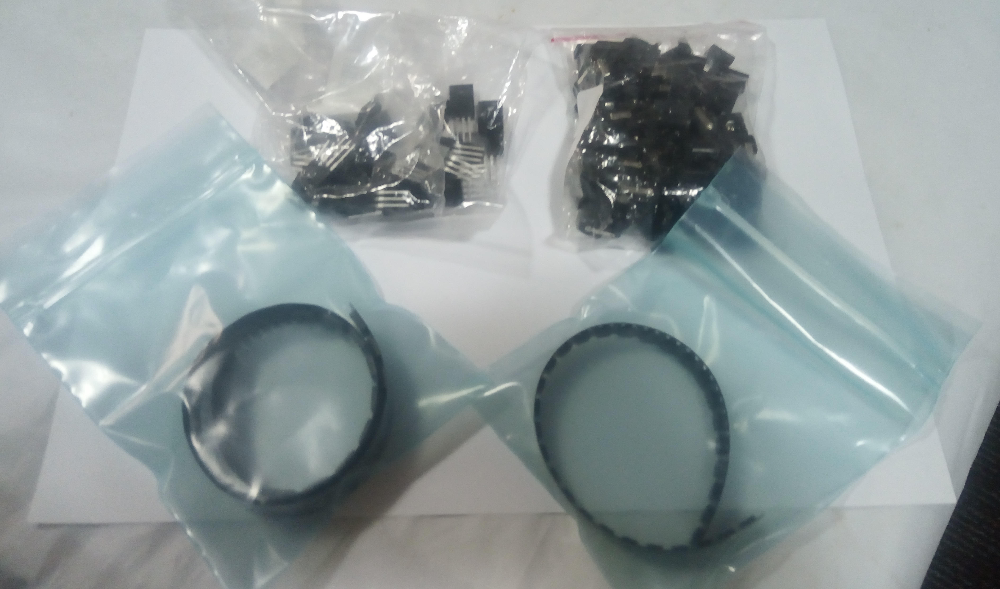

## General Update

`Last Modfified: 2021-05-16`

The team have been very busy over the past weeks on various projects - so this
is a small update from us. We hope to provide larger updates in the coming
weeks.

Some parts finally arrived! Pictured are the power transistors, DC barrel
jacks, voltage regulators and ATtiny85 controllers. This means that we can
begin validating the controller boards that arrived quite some time ago.

We have been making use of the [maker
space](https://canterbury.libguides.com/makerspace) on campus, located in the
library. Amongst various facilities, we made use of their badge machines to
make some sheep themed handouts. In the future we intended to make use of their
shirt printing facilities and their sewing machines for robot t-shirts!

Check back when we blow up some stuff in our testing!
