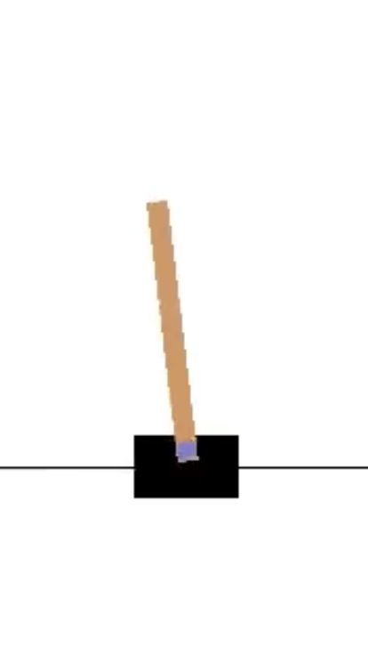

## Balance Engine

`Last Modfified: 2022-01-31`

**Note:** This article is a high-level discussion of a technical nature (in
comparison to other articles). We keep the discussion somewhat abstract but it
may still prove difficult to follow.

As eluded to in the previous [general update](2021-12-19.html), we are making
awesome progress since the last update over the Christmas period. One of the
projects we will discuss today is the concept of a *balance engine* and some of
the work that has happened around this.

### Brief History of RoboCup Walking

*In the beginning, there were robot dogs...*

<iframe src="https://www.youtube.com/embed/xXvhSE1no1w" allowfullscreen>
</iframe>

*Video: RoboCup Dog platform in Japan (2009).*

Dogs are great as an initial platform - they are stable and *cute*
^[Aesthetically pleasing robots are quite important, especially as by design
these competitions are conducted with lots of public engagement.]. Initial
problems can be addressed with respect to team play, vision, communication,
locomotion, etc, whilst offering fun and novel games for the public to engage
with.

~~Unfortunately~~ At some point it was decided that in order to achieve the
goal of robots vs people in 2050, they must be bipedal. In 2013, the [Bold
Hearts](https://robocup.herts.ac.uk/) decided to switch from a successful run
in the simulation league and enter into the humanoid league, which consists of
hardware!

*Turns out, bipedal walking is hard.*

Normally, for open-loop humanoid walking, we would have the open-loop walk send
motor commands without any feedback. This worked well for flat surfaces with
some walk engine parameter tweaking, and was appropriate in the domain space
for quite some years. This in turn gave teams time to work on other
advancements, such as vision and localisation.

<iframe src="https://www.youtube.com/embed/AoCVVbolh7E" allowfullscreen>
</iframe>

*Video: Bold Hearts DarwinOp player using an open-loop walk engine on a flat
surface (2013).*

This was never the [end-goal](https://robocup.org/objective) though, and some
years ago the challenge of walking was made more difficult with the additional
of artificial grass. This made the challenge of humanoid walking much more
difficult. For the first year of this rule change, very few teams could walk
reliably towards the ball. Of course, teams arose to the challenge and in the
next year most teams could walk somewhat reliably.

<iframe src="https://www.youtube.com/embed/CaZP5I9xwUw" allowfullscreen>
</iframe>

*Video: Bold Hearts (modified) DarwinOp player using an open-loop walk engine
on artificial grass (2018).*

As can be seen, the Bold Hearts and Electric Sheep teams (amongst others) have
utilized open-loop walk engines to achieve limited stability walking on
artificial grass. Typically this would involve tweaking per-robot walking
parameters for the particular field we intend to play on. We found that as the
robots became larger and their centre of mass was heightened, the issue of
stability became much more difficult.

<iframe src="https://www.youtube.com/embed/Y9JFQmkmr_A" allowfullscreen>
</iframe>

*Video: Electric Sheep player using an open-loop walk engine on artificial
grass (2020).*

As some teams find moderate success in continuing to tweak their walk
parameters, other teams turned to tried-and-true existing methods such as [zero
moment point](https://en.wikipedia.org/wiki/Zero_moment_point) (ZMP). ZMP is
quite an old well-tested approach and makes the assumption that you are able to
calculate centre of pressure (CoP), which can then be abstracted to centre of
mass (CoM), which is projected to be always within the 'support polygon' (an
area defined by the placement of the feet). ZMP works well, and in theory could
allow for behaviours such as walking, running, and even jumping - although
there has so far been limited success in these behaviours (at least within the
league).

### Challenges

There are several challenges we face in the RoboCup humanoid league that
differentiate us from other research approaches:

* **Real-time** - One of the major challenges RoboCup teams face is that this
problem of walking must be solved live, autonomously, on the robot itself.
Typically the computation resembles something like a modern Raspberry Pi due to
size, weight and power requirements of specific platforms. Many research
approaches will use tonnes of computation outside of the robot itself, a luxury
we do not have.
* **Objective** - Maintaining balance whilst doing some walk behaviour is
cool, but not in itself useful. The goal of our agents is not to balance a
walk, but actually to play football. Therefore it is not enough for them to
simply be stable, they must also be achieving their main objective.
* **Environment** - Our robots are not operating in some well known, well
tested lab - they instead operate on a football pitch made of artificial grass,
unknown until the week of the competition. Teams have just a few days to
calibrate their robots, fix any issues and then play competition matches.

Going further, ZMP only really solves behaviours where a support polygon can be
well defined. What if, for example, you wanted to do a flip, perform actions on
uneven or unknown terrain, etc? Modified versions of ZMP could in theory handle
much more complex scenarios, but these solutions become more complex and much
harder to define.

### A New Approach

What we are beginning to ask for is a *motion engine*, an engine that can solve
arbitrarily difficult motion tasks ^[This is the subject of a high-level
discussion journal paper.]. This remains the goal of future work, so for now we
work on a subset of this problem, which is an *adaptive balance engine* (ABE).

The intention of ABE is to take the suggestion of an open-loop walk engine,
adapt it in a way that provides stability, and then send the motor commands.
This does not rely on foot sensors, we do not provide any parameters to the
walk engine and *theoretically* we are not bound by the idea of a support
polygon, allowing for momentary instability if required.

We intend to publish more details about this approach at a later date.

### Initial Results

Our initial experiments were conducted using the [OpenAI Gym cartpole
problem](https://gym.openai.com/envs/CartPole-v1/), where the agent has the
ability to select `left` or `right` in each time step depending on some
observed state, which includes the cart position, velocity, pole angle and pole
velocity. Simulations end when the agent falls outside of some defined bounds.

Other approaches ^[Note: We only discuss those that have released their source,
as the cartpole problem is technically [optimally
solvable](https://link.medium.com/47hKaTmOFmb).], mostly consisting of
[reinforcement learning](https://gym.openai.com/envs/CartPole-v0/) (RL) are
slower to learn than our ABE approach. Most RL approaches appear to be based on
[DeepMind's DQN model](https://deepmind.com/research/open-source/dqn) from
2015. Our approach is somewhat more computationally expensive, but yields very
competitive results.

As you can see, it takes approximately 40 experiments for the agent to 'solve'
the problem maximally with a consistent score of 500 ^[A score of 500 is far
better than is required, the 'win' scenario is set to 195.].

**Note:** Due to the implementation, there is a 1% chance that the agent takes
a random action. This is for the purpose of training.

### Further Work

With the initial results showing promise, we now move into the [humanoid
simulation environment created by the Bold
Hearts](https://gitlab.com/boldhearts). Their platform is based on
[ROS2](https://arxiv.org/abs/1907.00282), which offers some nice abstractions
and allows for code sharing. This allows us to flesh out the concept whilst
minimizing damage to real hardware, as well as offering the ability to
pre-train the algorithm and minimize time spent on hardware.

(All going well) Going forwards, we intend to explore this research further
with the intention of deploying it in Bangkok, Thailand, for the [2022 RoboCup
World Cup](https://2022.robocup.org/).

*Keep tuned for future updates!*
