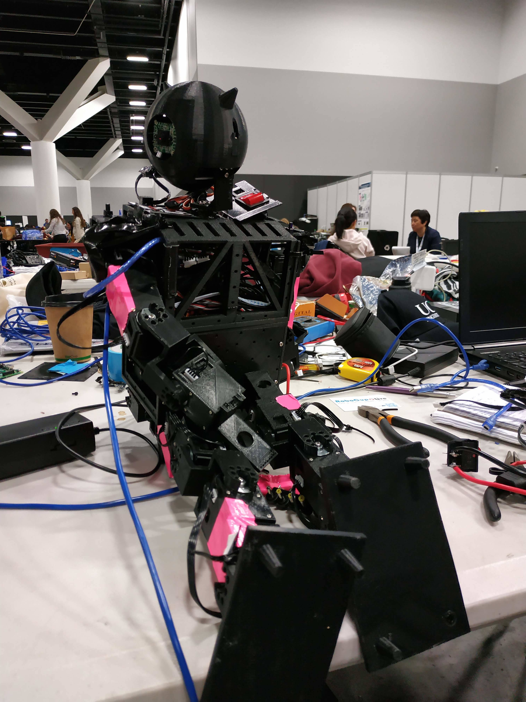

| | | | |
|-|-|-|-|
|||||

<iframe src="https://www.youtube.com/embed/Y9JFQmkmr_A" allowfullscreen>
</iframe>

## Blogs

## About Team

We are an up-and-coming humanoid RoboCup team for the kid-sized league [^1]
based in New Zealand, Christchurch. Our team mostly comprises of students from
the University of Canterbury [^2] without a robotics background, with a variety
of engineering backgrounds and from multiple disciplines. Our commonality is
our love for robots and passion to succeed.

Currently we work towards creating a unique low-cost 3D printed humanoid
platform, allowing it to be easily configurable and imported into simulations,
as well as keeping the financial barrier into the league low.

## Team Members

|                        |                        |
|:----------------------:|:----------------------:|
|  |  |
| Daniel Barry           | Merel Keijsers         |
|  |  |
| Humayun Khan           | Munir Shah             |
|  |                        |
| Banon Hopman           |                        |

Previous team members:

* Victoria Pryde
* Seong-Young Her
* Hussain Syed Kazmi
* Rory Clifford
* Andrew Curtis-Black
* Matthew Young

## Achievements

|           |                                                   |
|:---------:|:-------------------------------------------------:|
| `2019-07` | 2nd round RoboCup World Cup (Sydney, Australia)   |

## Releases

The following are our team publications and releases (newest first):

* `2019-10-06`
[xYOLO: A Model For Real-Time Object Detection](bin/xyolo-2019.pdf)
[[arXiv]](https://arxiv.org/abs/1910.03159)
* `2019-07-31`
[Electric Sheep Humanoid Robot Platform V1](https://github.com/electric-sheep-uc/black-sheep)
* `2019-07-31`
[Black Sheep: Low-Cost Open Source Humanoid](bin/platform-2019.pdf)
* `2018-12-03`
[Team Description Paper 2019](bin/tdp-2019-b.pdf)
[[arXiv]](https://arxiv.org/abs/1910.08949)
* `2018-12-03`
[Robot Specification 2019](bin/specs-2019.pdf)

## Press

The following are press pieces by year and month:

### 2019 December

* [IEEE Robotics & Automation Magazine](https://ieeexplore.ieee.org/stamp/stamp.jsp?tp=&arnumber=8930897)
[[Archive](bin/08930897.pdf)]

### 2019 July

* Radio Australia
[[Archive](bin/RadioAus-2019.m4a)]
* [University of Canterbury](https://www.canterbury.ac.nz/news/2019/ucs-soccer-robots-only-nz-team-in-international-robocup.html)
[[Archive](http://web.archive.org/web/20190713045240/https://www.canterbury.ac.nz/news/2019/ucs-soccer-robots-only-nz-team-in-international-robocup.html)]
* [Mirage News](https://www.miragenews.com/university-of-canterbury-s-soccer-robots-only-nz-team-in-international-robocup/)
[[Archive](http://web.archive.org/web/20190714063302/https://www.miragenews.com/university-of-canterbury-s-soccer-robots-only-nz-team-in-international-robocup/)]
* [Voxy](http://www.voxy.co.nz/national/5/342853)
[[Archive](http://web.archive.org/web/20190714063344/http://www.voxy.co.nz/national/5/342853)]
* [Scoop](http://www.scoop.co.nz/stories/CU1907/S00108/ucs-soccer-robots-only-nz-team-to-qualify-in-robocup.htm)
[[Archive](http://web.archive.org/web/20190711144043/http://www.scoop.co.nz/stories/CU1907/S00108/ucs-soccer-robots-only-nz-team-to-qualify-in-robocup.htm)]
* [RNZ](https://www.rnz.co.nz/audio/player?audio_id=2018703576#)
[[Archive](bin/ngts-20190710-2135-robocup_2019-128.mp3)]

## Contact Us

This is a PR package release for use in articles:
[electric-sheep-pr-2019-04-20.zip](bin/electric-sheep-pr-2019-04-20.zip).

Please contact us via:
[danbarry16@googlemail.com](mailto:danbarry16@googlemail.com)
regarding any question you may have. Allow a few days for a response!

## References

[Free Vectors by Vecteezy.com](https://www.vecteezy.com/)

[^1]: Site: [https://www.robocuphumanoid.org](https://www.robocuphumanoid.org)

[^2]: Site: [http://www.canterbury.ac.nz](http://www.canterbury.ac.nz)
